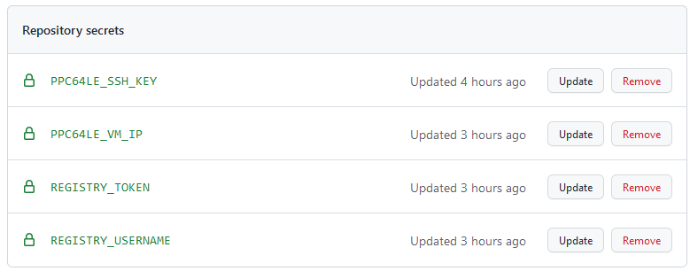

## Cross Build Image & Deploy On Remote K8s Using Github Actions

Github action workflow to prform a cross build of a `ppc64le` image using buildx in github action and deploy it onto a remote `ppc64le` kubernetes cluster in IBM cloud.

#### Workflow

1. Build cross compile image for ppc64le using buildx
2. Setup access to remote private registy & ppc64le kubernetes cluster in IBM-Cloud
3. Push the built image to private registry
4. Deploy the image onto a remote ppc64le kubernetes cluster

Github action workflow is defined in [k8s.yaml](./github/workflows/k8s.yaml)

#### Secrets

Following secrets are created in github repo

